# Highlight of car licenses project
Repositório destinado para implementação de projeto avaliativo do curso de processamento de imagens digitais.

Vídeo no YT: https://youtu.be/eE8XIyCWZ00

Referência original: https://universe.roboflow.com/roboflow-universe-projects/license-plate-recognition-rxg4e

## Objetivos Gerais do Projeto
- Levando em consideração que o projeto original baseia-se na detecção de placas através de técnicas de visão computacional, o mesmo não poderá ser reproduzido nesse projeto visto que há temas que não foram abordados em sala de aula, então o escopo do projeto a ser desenvolvido nesse notebook destina-se a uma implementação bem mais simples e rigorosa com os conteúdos abordados em sala de aula.

- O projeto a ser desenvolvido, sobre a base de imagens do projeto mencionado acima, que apresenta um conjunto de imagens de carros, tem como objetivo o destaque das regiões da imagem que representam as placas dos carros.

- A princípio, tenho como objetivo explorar as técnicas de filtro para melhorar a visibilidade da imagem e realçar áreas de interesse, utilizar técnicas de thresholding para tornar a imagem binária e por fim utilizar técnicas de segmentação de imagens como as transformadas de hough para identificar as retas na imagem, o que acredito que irá facilitar a detecção de formas de interesse na imagem, o que nesse caso são as placas dos veículos, além disso também tenho como objetivo tentar implementar as transformações geométricas para tentar deixar sempre a imagem o mais horizontal possível.

## Como utilizar
- Requisitos:
    - Python 3.x
    - Bibliotecas: numpy, matplotlib, skimage
- Execução:
    - Clone o repositório
    - Abra o arquivo .ipynb em /src/
    - Na célula abaixo de "Passo 1" verifique se o caminho para a imagem está como "img/car_XX" e altere a string para ver 
    o script rodando para diferentes imagens.
    - Execute as células sequencialmente par observar a evolução do processamento de cada etapa.

## Experimentos e Eficácia do projeto

- Para visualizar as estatísticas e eficâcia do projeto acesse o arquivo src/experiments.ipynb

### Resultados obtidos e observações:
- Observei durante os experimentos que a faixa do limiar impacta diretamente no desempenho do algortimo, quanto menor o coeficiente, pior o desempenho do algoritmo e para algumas imagens o recorte também não funcionou adequdamente, foi necessário testar empiricamente cada coeficiente para verificar qual era mais adequado para cada imagem.

- Total de testes: 10
- Testes em que a rotação foi satisfatória: 6
- Testes em que o recorte foi satisfatório: 5

#### PORTANTO O PROJETO TEM UMA EFICÁCIA DE 50-55%

Coeficiente: 0.30 \ Alinhamento BOM \ Recorte BOM

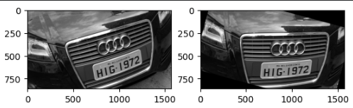

Coeficiente: 0.30 \ Alinhamento BOM \ Recorte RUIM

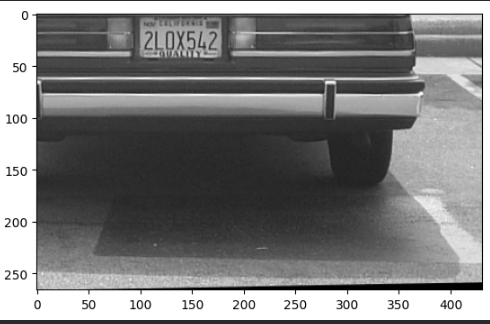

Coeficiente: 0.30 \ Alinhamento BOM \ Recorte RUIM

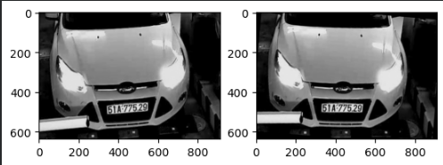

Coeficiente: 0.15 \ Alinhamento RUIM \ Recorte RUIM

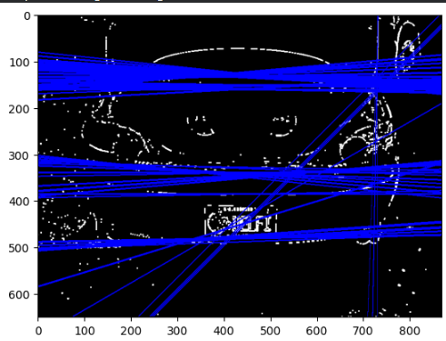
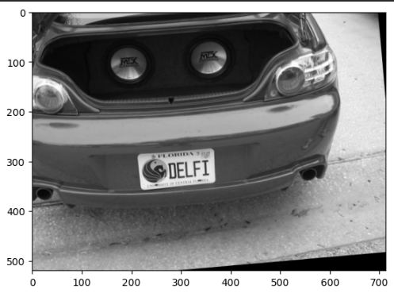

Coeficiente: 0.10 \ Alinhamento RUIM \ RECORTE OK

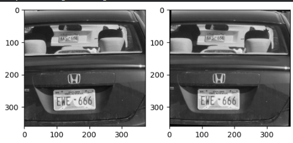

Coeficiente: 0.25 \ Alinhamento RUIM \ RECORTE RUIM

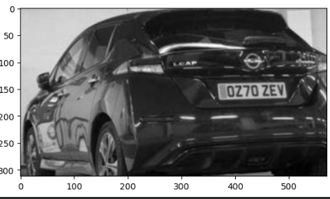

Coeficiente: 0.15 \ Alinhamento NULO \ RECORTE NULO

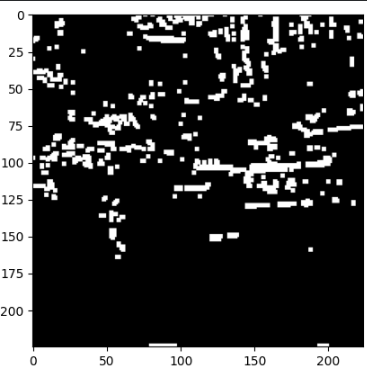

Coeficiente: 0.20 \ Alinhamento BOM \ RECORTE OK

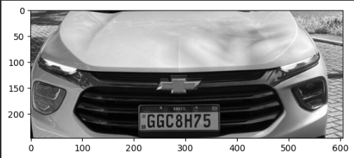

Coeficiente: 0.20 \ Alinhamento RUIM \ Recorte BOM

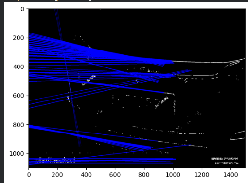
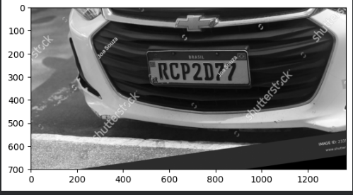

Coeficiente: 0.30 \ Alinhamento ÓTIMO \ Recorte ÓTIMO

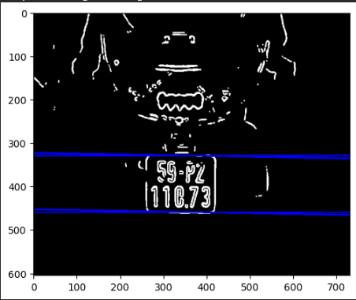
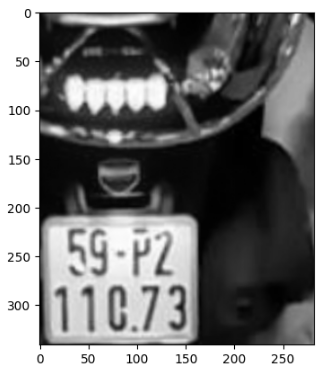
